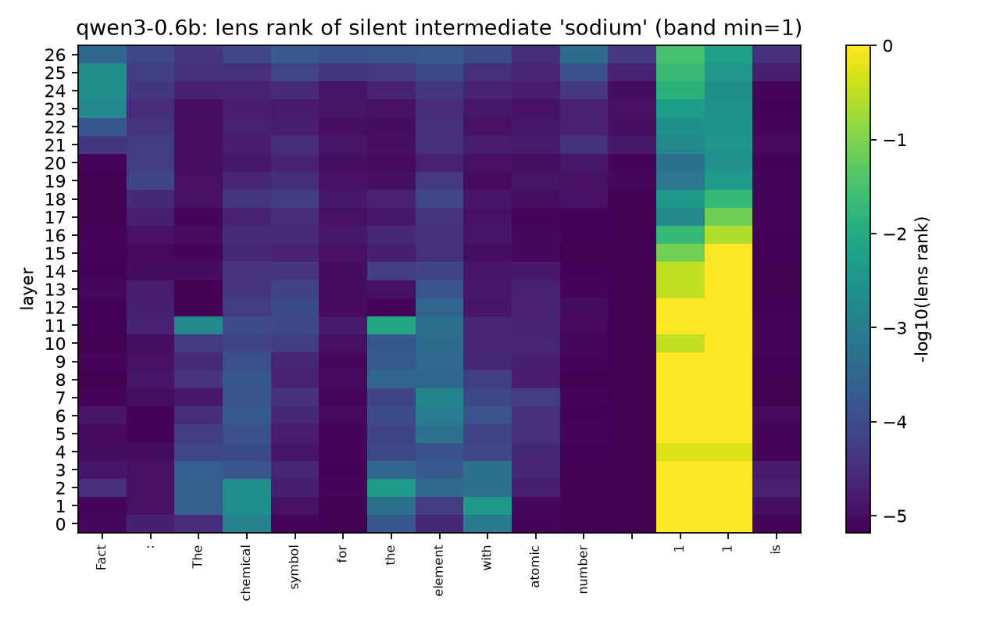

# jlens-scaling — does the global workspace exist in small models?

CPU-only replication and scale study of the **Jacobian lens** from Anthropic's
["Verbalizable Representations Form a Global Workspace in Language Models"](https://transformer-circuits.pub/2026/workspace/index.html)
(July 2026). No GPU required; the entire stack is $0.

The paper studies production-scale Claude models and explicitly leaves open
*"whether smaller models have an equally rich workspace, a proportionally
smaller one, a less reliable one, or none at all."* This repo is Phase 1
(replication + tooling) of a scale study answering that question on open
models, starting from the bottom of the ladder.



*Qwen3-0.6B answering an atomic-number→symbol question: the element name
("sodium") is lens rank 1 in the mid-layer band — and is never said.*

## Phase 1 results — the first two rungs (fitted on a 10-core desktop CPU)

Fitting: 100 wikitext-103 prompts each (seeded, cached), official
[`jlens`](https://github.com/anthropics/jacobian-lens) estimator, `dim_batch=16`.
GPT-2-124M: **80 min**; Qwen3-0.6B: **≈8.5 h** (checkpoint-resumed across
interruptions). Full provenance in `results/*/fit_summary.json`.

| | GPT-2-124M (base) | Qwen3-0.6B (instruct) |
|---|---|---|
| Verbal report: valid answers | 5/14 | 10/14 |
| … valid answers band-readable (rank ≤ 5) | **0/5** | **0/10** |
| Two-hop baseline accuracy | 7/90 (8%) | 8/90 (9%) |
| … silent intermediate readable, correct items | 5/7 (71%) | **7/8 (88%)** |
| … intermediate ranks on those items | 2–21 | **1–6** |

**Verbal report is absent at both rungs.** Neither model's forthcoming answer
is band-readable at rank ≤ 5 before the answer position — though near-misses
(GPT-2's *Earth* and *football* at rank 7; Qwen's *tea* at 42) hint at a weak
precursor. Full rank grids are stored in `results/` for secondary analyses.

**The silent-intermediate signature sharpens with scale.** Two-hop capability
is equally floor-level at both sizes (8–9%), but *among the items each model
gets right*, the unspoken bridge entity reads out more often and far more
sharply in Qwen3-0.6B: *France* at rank 2 while answering *Paris*, *sodium* at
rank 1 while answering *Na*, *Shakespeare* at rank 2 while answering *William*
([`results/qwen3-0.6b/two_hop.json`](results/qwen3-0.6b/two_hop.json)).

**Layer structure matches the paper qualitatively.** Early-layer readouts are
noise at both rungs (the paper reports the same); GPT-2's Eiffel-Tower readout
develops a coarse "European city" region (`Constantinople` → `Zurich` →
`Cologne` at layers 6–10) that never resolves to *Paris* — and it answers
*London*.

**Interpretation (cautious, small-n):** at these scales, workspace-style
readout appears only where capability exists — and it's the readout's
*sharpness*, not task accuracy, that improved from 124M to 0.6B. Whether that
trend continues is what the pre-registered ladder
([`docs/preregistration-draft.md`](docs/preregistration-draft.md)) measures;
GPT-2-355M and Qwen3-1.7B land next.

A methodological note for anyone replicating on chat models: grading the
model's *first greedy token* silently breaks on chat tokenizers (Qwen emits
`S` as the first token of *Strawberry*, and `<|im_end|>` can leak into naive
decoding). Our runners grade the first decoded *word* and accept both
leading-space BPE token variants.

## Reproduce

```bash
python -m venv .venv && .venv/Scripts/pip install -e ".[dev]"   # Windows: see note below
pytest tests -q                                                  # 13 tests, ~5 s
python scripts/fit_lens.py --config configs/gpt2-small.yaml      # ~80 min on 10 CPU cores
python scripts/run_experiment.py --config configs/gpt2-small.yaml --experiment two_hop --lens artifacts/gpt2-small/lens.pt
python scripts/make_figures.py --results results/gpt2-small/two_hop.json --out figures --slug gpt2-small
```

Fitting checkpoints after every prompt and resumes automatically. Pre-fitted
lenses (skip the fit entirely):
[huggingface.co/blzphnx/jlens-scaling-lenses](https://huggingface.co/blzphnx/jlens-scaling-lenses)
— load with `JacobianLens.from_pretrained("blzphnx/jlens-scaling-lenses", filename="gpt2-small/lens.pt")`.

**Windows note:** if `pip install torch` fails with `WinError 206`, either
enable NTFS long paths (admin) or create the venv at a short path like
`C:\venvs\jl` — the torch wheel contains very deep license directories.

## Relation to the official code

Uses [anthropics/jacobian-lens](https://github.com/anthropics/jacobian-lens)
(Apache-2.0) as a pinned, unmodified library dependency — all Jacobian math is
the reference implementation's. Prompt sets are vendored under
[`data/anthropic/`](data/anthropic/) with attribution. This is independent
work, not affiliated with Anthropic.

## Limitations

Readout-only replication (causal swaps are Phase 2); one fitting corpus
(wikitext-103); band = middle third of layers, to be frozen formally in the
Phase 2 pre-registered metrics before any cross-scale comparisons; two-hop
readability is conditioned on tiny n at this model size; small-model results
may reflect capability limits rather than workspace absence — separating those
is exactly what the scale study is for. Functional claims only: nothing here
bears on consciousness.

## License

Apache-2.0.
