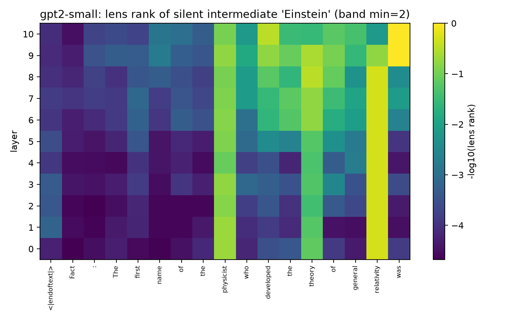

# jlens-scaling — does the global workspace exist in small models?

CPU-only replication and scale study of the **Jacobian lens** from Anthropic's
["Verbalizable Representations Form a Global Workspace in Language Models"](https://transformer-circuits.pub/2026/workspace/index.html)
(July 2026). No GPU required; the entire stack is $0.

The paper studies production-scale Claude models and explicitly leaves open
*"whether smaller models have an equally rich workspace, a proportionally
smaller one, a less reliable one, or none at all."* This repo is Phase 1
(replication + tooling) of a scale study answering that question on open
models, starting from the bottom of the ladder.



## Phase 1 results (GPT-2-124M, lens fitted in 80 min on a 10-core desktop CPU)

Fitting: 100 wikitext-103 prompts (seeded, cached), official
[`jlens`](https://github.com/anthropics/jacobian-lens) estimator, `dim_batch=16`,
full provenance in [`results/gpt2-small/fit_summary.json`](results/gpt2-small/fit_summary.json).

**Layer evolution matches the paper qualitatively.** On
`"Fact: The capital of the country where the Eiffel Tower is located is the city of"`,
early-layer readouts are noise, and a coarse "European city" region emerges
mid-to-late (`Constantinople` → `Zurich` → `Cologne` at layers 6–10) — but it
never sharpens to `Paris`, and the model itself answers `London` (Paris ranked 2).

**Verbal report is absent at 124M — a capability-floor result.** On the paper's
14-category "think of a {category}" set, GPT-2 (base) produces a non-degenerate
answer in only **5/14** categories (the rest are punctuation or category echoes,
which we flag and exclude), and **0/5** of those answers are readable in the
mid-layer band (top-5) before the answer position
([`results/gpt2-small/verbal_report.json`](results/gpt2-small/verbal_report.json)).

**Silent two-hop intermediates show a proto-workspace signal.** On the paper's
90 two-hop prompts, GPT-2 answers only **7/90 (8%)** correctly — but on **5 of
those 7 (71%)**, the unspoken bridge entity (e.g. *Hungary* when answering
*Budapest* to "the capital of the country whose language is Hungarian") is
readable in the band at rank ≤ 5
([`results/gpt2-small/two_hop.json`](results/gpt2-small/two_hop.json)).

**Interpretation (cautious):** at 124M, workspace-*style* readouts appear only
where the underlying capability exists at all. Small-n; the scale ladder
(0.6B → 1.7B → 4B) is the actual test. Qwen3-0.6B results land next.

## Reproduce

```bash
python -m venv .venv && .venv/Scripts/pip install -e ".[dev]"   # Windows: see note below
pytest tests -q                                                  # 13 tests, ~5 s
python scripts/fit_lens.py --config configs/gpt2-small.yaml      # ~80 min on 10 CPU cores
python scripts/run_experiment.py --config configs/gpt2-small.yaml --experiment two_hop --lens artifacts/gpt2-small/lens.pt
python scripts/make_figures.py --results results/gpt2-small/two_hop.json --out figures --slug gpt2-small
```

Fitting checkpoints after every prompt and resumes automatically. Pre-fitted
lenses (skip the fit entirely):
[huggingface.co/blzphnx/jlens-scaling-lenses](https://huggingface.co/blzphnx/jlens-scaling-lenses)
— load with `JacobianLens.from_pretrained("blzphnx/jlens-scaling-lenses", filename="gpt2-small/lens.pt")`.

**Windows note:** if `pip install torch` fails with `WinError 206`, either
enable NTFS long paths (admin) or create the venv at a short path like
`C:\venvs\jl` — the torch wheel contains very deep license directories.

## Relation to the official code

Uses [anthropics/jacobian-lens](https://github.com/anthropics/jacobian-lens)
(Apache-2.0) as a pinned, unmodified library dependency — all Jacobian math is
the reference implementation's. Prompt sets are vendored under
[`data/anthropic/`](data/anthropic/) with attribution. This is independent
work, not affiliated with Anthropic.

## Limitations

Readout-only replication (causal swaps are Phase 2); one fitting corpus
(wikitext-103); band = middle third of layers, to be frozen formally in the
Phase 2 pre-registered metrics before any cross-scale comparisons; two-hop
readability is conditioned on tiny n at this model size; small-model results
may reflect capability limits rather than workspace absence — separating those
is exactly what the scale study is for. Functional claims only: nothing here
bears on consciousness.

## License

Apache-2.0.
